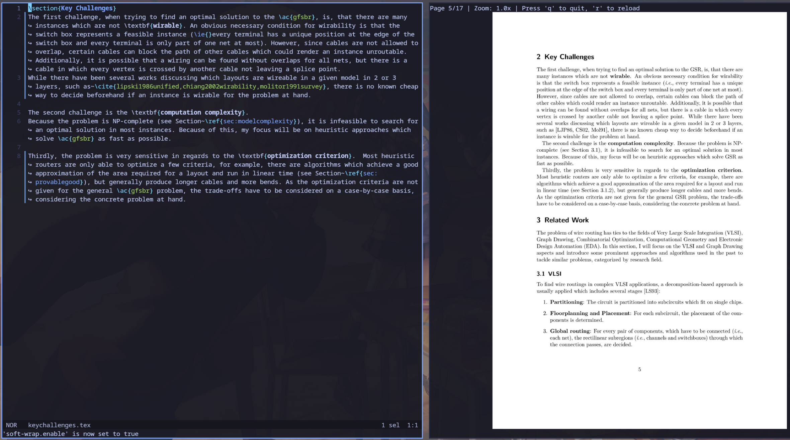

# TermPDF
A simple PDF-viewer to be used inside a [compatible terminal](https://sw.kovidgoyal.net/kitty/graphics-protocol/).

It works by converting a PDF into images using PyMuPDF and displaying these images in the terminal using the graphics protocol. On detecting a file change, the viewer automatically reloads the current page.
A use case for this can be writing and displaying a LaTeX document side-by-side in a terminal multiplexer.

## Usage
- call using `viewer <file.pdf>`
- Zoom using + and - keys
- Reload manually using r
- Press q or ctrl+c to quit.

